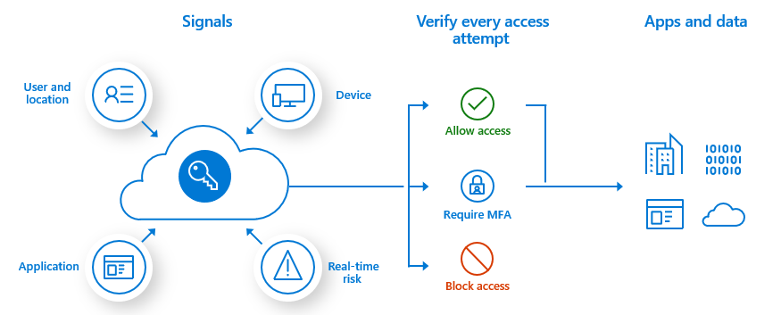

# Conditional Access Policies

[Read more](https://learn.microsoft.com/en-us/entra/identity/conditional-access/overview)

> Note! Each user under the scope of the policy requires at least a P1 license.

Modern security includes several factors when giving access to resources. Rather than just being within a network, it now factors identity and other factors for all signals before given access. These factors include:

1. User or group membership: Based on the fine-grained permissions for the user/group.
2. IP Location: Admins can block certain regions/countries
3. Device: Platforms or state of device.
4. Application?
5. Real-time risk based: Advanced Risk factor calculated based on user access patterns (e.g. location, attempts). Each user requires P2 license.
6. Microsoft Defender for clouds?

It is simply if-then statements based on those factors.

## Common decisions

1. Block access
2. Grant access
    - Require MFA
    - Require password change
    - Require device to be marked compliant.
    - etc...
