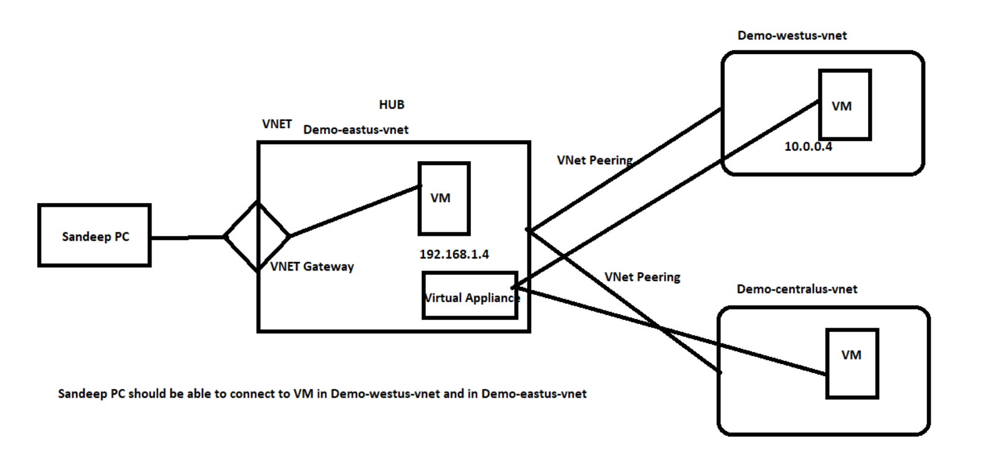

# Hub and Spoke Model project

This is a project where you have to implement the architecture shown in the diagram below. It is the Hub and Spoke Model where there is one Hub network that is connected to other networks that are spokes. These spokes cannot communicate to other spokes directly. Traffic from one spoke to another must travel via Hub.

## Requirements

1. One Hub network and two Spoke networks. All three are in different regions.
2. Spokes are Network Peered only to Hub.
3. My PC is connected to Hub with VPN.
4. From my PC, I can connect to a VM in Spoke1 using its private IP.
5. From my PC, I can connect to a VM in Spoke2 using its private IP.
6. Spoke1 VM can connect to Spoke2 VM via Hub by setting up Route tables and Virtual Appliance in Hub.
7. Spoke2 VM can connect to Spoke1 VM via Hub by setting up Route tables and Virtual Appliance in Hub.

## Problems with this model

1. Increased cost
2. Additional ingress and egress costs to different regions for spokes to communicate.
3. Costs of running a virtual appliance. 

